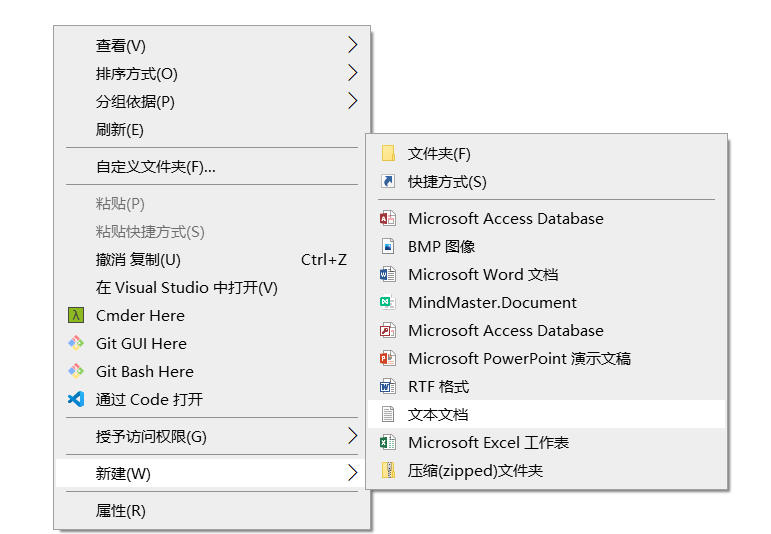
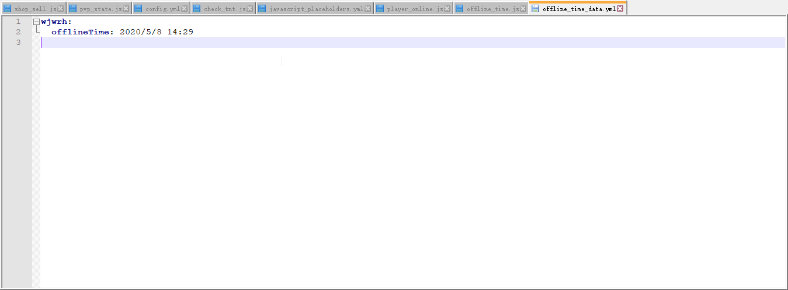

# [实战教程] JavaScript&PlaceholderAPI 从入门到精通

## 一、前言

* 为什么要写这篇教程？
  * 站内(指MCBBS中文论坛)已经有**两篇**相关的教程了，但是我发现有人看了这些教程之后，还是一头雾水(而且他们好像都在咕)，不知道从何动手，而且他们对于`PlaceholderAPI JS扩展`的精髓都没有怎么提及，因此我决定从**实战**角度出发，设立若干情景，旨在帮助那些连JS都不怎么会的人，能够直接依葫芦画瓢解决他们的问题；帮助那些了解JS的人去接触`PlaceholderAPI JS扩展`中最强最好用的功能(因为我发现官方的wiki里压根就没有详细介绍过这些功能的使用)
  * **只要我一次性写完，我就能保证我不会鸽了！！**
* 本教程的结构？
  * 本教程分为三个部分，第一部分是比较详细的基础介绍，第二部分是若干种场景的实战教程，有临时需求的小白可以直接看实战部分，找到自己需要的代码抄走修改。第三部分为高级用法，利用`JS引擎`的特性调用`Java`中的类
* 这篇教程的受众是？
  * 完全没有`JS`知识，但是有学习动力的小白，我会尽可能的省略有关`JS`的技术细节(虽然还是强力推荐你们系统的学习一下`JavaScript`)，帮助你们只要稍微改动几个特定的值就能够实现你们自己需要的`JS`脚本
  * 有一定的`JS`基础或插件编写基础的人群，我会简要的介绍`PlaceholderAPI JS扩展`的灵魂，`BukkitPlayer`与`BukkitServer`<!-- more -->
* 什么是`JavaSript`，和`Java`有关系吗？`JS`是不是就是`Java`的脚本？
  * 首先要明确的就是，`JavaScript`和`Java`的关系就像雷锋和雷峰塔一样，八竿子打不着。
  * JavaScript（通常缩写为JS）是一种高级的、解释型的编程语言[8]。JavaScript是一门基于原型、函数先行的语言，是一门多范式的语言，它支持面向对象编程，命令式编程，以及函数式编程。它提供语法来操控文本、数组、日期以及正则表达式等，不支持I/O，比如网络、存储和图形等，但这些都可以由它的宿主环境提供支持。
  * `Java`内置了`Nashorn`引擎(`JDK 1.8`以前是`Rhino`)，而`PlaceholderAPI`就是直接使用这个引擎，来对`JS`脚本进行解析，从而执行并获取我们脚本返回的结果
* 本教程使用环境
  * 系统环境 `Windows 10 Professional Edition 1909`(理论上本教程对于`Linux`也适用)
  * 服务端 `Spigot 1.15.2`
  * 插件 `PlaceholderAPI-2.10.5`(插件版本影响不大)
  * 文本编辑器 `Notepad++` (为了适配大多数人，没有使用VSC，你没有Notepad++的话用Notepad也行xd)


## 二、基础细节讲解

### 1. 安装JavaScript扩展

* 使用`ecloud`安装
  * 此安装比较简单只需要几个命令即可
  * `/papi ecloud download javascript`
  * `/papi reload`
* 使用现有的文件进行安装
  * 有时`ecloud`会抽风，这个时候我们可能需要自己找到自己需要的扩展文件(我已经在下面提供了最新版的`JS`扩展文件)
  * 将下载好的文件放入`plugins\PlaceholderAPI\expansions`中
  * `/papi reload`

### 2. 常用JavaScript扩展的指令

* `/jsexpansion` 显示此扩展相关信息
* `/jsexpansion reload` 重载此扩展，不推荐使用这个，推荐使用`/papi reload`，使用这个可能会出现你修改了扩展但是并没有马上生效的问题
* `/jsexpansion list` 显示已加载的所有扩展

### 3. 创建一个新的JavaScript变量

* 打开`plugins\PlaceholderAPI`文件夹，在扩展正常加载的情况下这里应该有如下内容

  * 名为`javascript_placeholders.yml`的文件
  * 名为`javascripts`的文件夹

* 在`javascripts`文件夹中新建一个**纯文本文档**

  

* 修改其名称为`<你的扩展标识名>.js`，例如我这里修改成`test.js`

* 修改完成之后，打开上面提到的`javascript_placeholders.yml`文件，在文件的最下面添加

  ```yaml
  <你的扩展标识名>:
    file: <你的扩展标识名>.js
    engine: nashorn
  # 使用Java 7开服的请在engine处填写Rhino
  ```

  例如我上面命名为`test.js`，那么我就需要添加

  ```yaml
  test:
    file: test.js
    engine: nashorn
  ```

* 在`<你的扩展标识名>.js`里面写上你的脚本，然后重载一次，你就可以使用`%javascript_<你的扩展标识名>%`这个变量啦，例如我的就是`%javascript_test%`

### 4. 调试JS脚本

* 方法一(不推荐) 可以将自己的脚本放在其他的计分板之类的插件中，这样的弊端是如果你想要修改你的扩展的名字，还要重新修改计分板插件的配置并将其重载，而且在实际服务器中测试对玩家的游戏体验有影响

* 方法二(推荐) 使用`PlaceholderAPI`自带的指令`/papi parse me 扩展名`，即可在自己这里显示这个变量对自己产生的效果

  

## 三、各种场景的实战演示

### 场景一  修改已有的placeholder为你想要的类型

#### 1. 场景描述

* 有一个插件名为`PvPToggle`，它可以让玩家自行开/关`PVP`状态，我想在侧边计分板中实时显示玩家的`PVP`状态，碰巧，它提供了一个名为`%pvptoggle_pvp_state%`的变量，直接用吧！但是它居然是英文的？那就让我们来修改它吧！

#### 2. 创建新的JS变量

* 根据上面一大模块中3的步骤，我们新建一个名为`pvp_state`的变量

* 这里直接上我写好的`pvp_stage.js`的内容，并在下面逐一讲解每一行代码的作用，以及各个字符串是怎么得来的

  ```javascript
  function pvpstate() {
  	if("%pvptoggle_pvp_state%".endsWith("Off"))
  		return "关闭";
  	else
  		return "开启";
  }
  
  pvpstate();
  ```

  * `function pvpstate(){...}` 这是一个声明函数的语句，使用`function`关键字声明了一个名为`pvpstate`的函数，可以任意取名，但是最好起仅包含英文字母、阿拉伯数字以及下划线_组成的名字

  * `pvpstate();` 调用上面声明的函数，如果你在上面修改了函数名，那么这里也需要一并修改，写好的函数一定要进行调用，否则不会执行，你的js变量也不会返回任何东西

  * `"%pvptoggle_pvp_state%".endsWith("Off")` 这里体现了`js`扩展的一个优势，就是可以直接调用现有的placeholder变量，我们这里将获取`%pvptoggle_pvp_state%`这个变量，将其存储在一个字符串内，调用`endsWith("Off")`方法，来获悉`%pvptoggle_pvp_state%`这个变量是否是以`Off`进行结尾的，根据我们前面讲到的，如果它是以`Off`结尾的，那么它就会执行`代码块1`的内容，即`return "关闭";`那么你的变量就会显示`关闭`，否则，不以`Off`结尾的话，你的脚本就会执行`代码块2`的内容，即`return "开启";`那么你的变量就会显示`开启`

  * 我怎么知道为什么这里要写`Off`？这是通过我们对你要修改的变量研究得来的，我们可以首先对自己测试一下你要修改的变量会怎么显示，即上述`调试js脚本`中介绍的方法2，使用命令`/papi parse me %pvptoggle_pvp_state%`，来进行查看

    

    我们可以看到在玩家PVP状态关闭的情况下，`%pvptoggle_pvp_state%`会返回绿色的Off字样，所以我们需要检测这个变量是否是以`Off`进行结尾的，不直接判断是不是相等，是因为前面有颜色代码，直接判断结尾可以避免查找相关颜色代码的麻烦过程

#### 3. 加工处理现有Placeholder的通式(可直接套用走)

```javascript
function main() {
	if(表达式)
		return "表达式成立"; //双引号里面的内容可以直接修改
	else
		return "表达式不成立";
}
main();
```

* 表达式的内容可以为以下几种(只列出基础常用的，以下用`%placeholder%`代替你想要加工的变量)
  * `"%placeholder%" == "abc123"` 变量的内容是否与`abc123`**完全相同**，(abc123可修改，下面几项不再额外说明)
  * `"%placeholder%".endsWith("abc123")` 变量是否以`abc123`结尾
  * `%placeholder% >= 123` 变量的**数值**是否大于或等于`123`，这里需要你确认你需要加工的变量是一个数字，否则结果将会不可预期，注意这里的变量不需要用引号围起来，因为它不是一个字符串！`>=`符号可以替换为
    * `>` 大于
    * `<` 小于
    * `==` 等于(这里与第一个方法不太一样，第一个是判断字符串相等，这一个是判断数值相等)
    * `>=` 大于或等于
    * `<=` 小于或等于
    * `!=` 不等于


### 场景二  在玩家进服时判断玩家是否有指定物品并执行相应操作

#### 1. 场景描述

注意，本场景索要实现的目的需要配合一个能在玩家进服时执行指令的插件实现，这里我选用了[DeluxeJoin](https://www.mcbbs.net/thread-914738-1-1.html)，然后本例实现了在玩家进入服务器时，如果背包内拥有TNT，则将其清除掉，并且扣除其100元。本脚本会用到我上面提到的两个特别强特性

#### 2. 代码详解

话不多说，先上脚本

```javascript
var playerName = BukkitPlayer.getName();

function check_tnt(){
	if("%checkitem_mat:TNT%" == "yes") {
		runCMD("clear " + playerName + " tnt");
		runCMD("eco take " + playerName + " 100");
	}
	return;
}

function runCMD(cmd) {
	BukkitServer.dispatchCommand(BukkitServer.getConsoleSender(), cmd);
}

check_tnt();
```

* `var playerName = BukkitPlayer.getName()` 
  * 对于熟悉写插件的同学：熟悉写插件的同学可能觉得看起来很熟悉，`getName()`不是`Player`接口定义的一个方法吗？对，没错，`papi的js扩展`会内置两个特殊的变量，`BukkitPlayer`和`BukkitServer`，其中`BukkitPlayer`变量是执行这个变量的玩家实例，而`BukkitServer`则对应你的`Bukkit`对象。你不仅仅可以调用`getName`方法，还可以调用其它的属于`Player`的方法
  * 对于萌新小白：这一句话声明了一个变量`playerName`，`JS`声明并赋值变量的语法是`var 变量名 = 变量值`，你只需要知道这句代码把调用这个变量的玩家名赋值给了`playerName`即可
* `function check_tnt() {...}` 这是我们这个扩展的主函数
  * `if("%checkitem_mat:TNT%" == "yes") {...}` 用来判断玩家背包里面是否有TNT，注意，需要先安装papi的`checkitem`扩展，不然有可能会出问题。至于为什么判断是不是等于`"yes"`，而不是判断是不是等于其他值，自己用场景一的方法试一下就知道了
    * 两条`runCMD(...)` 这里调用了我们在下面定义的一个函数，我们在下面讲
* `function runCMD(cmd) {...}` 这里定义了一个另外的函数，将重复使用的一块代码抽出来新定义一个函数是一个良好的代码习惯。这个括号里的`cmd`是函数的参数，需要在调用的时候填写这个参数，例如上面`runCMD("clear " + playerName + " tnt");` 我们就将`"clear " + playerName + " tnt"`的结果作为cmd传送给了这个函数，那么我们在执行这个函数的时候，`cmd`所在的地方，可以视作全部被`"clear " + playerName + " tnt"`的执行结果所替代
  * `BukkitServer.dispatchCommand(...)`
    * 这里调用了`Bukkit`类的`dispatchCommand`方法，如果你对插件编写有一定的了解的话相信这个东西不会陌生，如果纯萌新的话...emmmm，直接把这个函数复制走就好了，不要管这是什么东西

#### 3. 在JS脚本中直接执行指令的通式及BukkitServer的常用方法

```javascript
function runCMD(cmd) {
	BukkitServer.dispatchCommand(BukkitServer.getConsoleSender(), cmd);
}

function runPlayerCMD(cmd) {
    BukkitServer.dispatchCommand(BukkitPlayer, cmd);
}
```

你只需要在你自己写的主函数里面调用`runCMD("命令")`即可以控制台身份执行命令，而调用`runPlayerCMD("命令")`即可以触发这个`placeholder`的玩家身份执行命令

* `BukkitServer`的常用方法(其实绝大多数功能都能通过执行命令来实现，不过我还是写一写吧，完整的可以看[这里](https://hub.spigotmc.org/javadocs/spigot/org/bukkit/Bukkit.html))
  * `BukkitServer.broadcastMessage("公告", "权限节点")` 给拥有指定权限节点的玩家发送公告
  * `BukkitServer.dispatchCommand("指令发送者", "指令");` 指令发送者可以是`BukkitServer.getConsoleSender()`--控制台，也可以是`BukkitPlayer`--触发该变量的玩家
  * 看来看去好像能在`JS`脚本里面常用的也不多了，暂时就写两个吧

### 场景三  根据变量参数生成随机数

#### 1. 场景描述

有时我们可能希望我们的脚本不要太过于死板，或者你有可能在想，我怎么样才能写一个`%player_has_permission_<permission>%`这样的变量出来呢？这个场景足以帮你解决问题！

#### 2. 代码详解

这里我们创建的扩展标示名为`args_test`，对应的变量则为`%javascript_args_test%`

```javascript
var min = 1;
var max = 25;

function randomInteger() {
   if (args.length == 2) {
       min = args[0];
       max = args[1];
   }

   var random = Math.random() * (max - min);
       random += min;

   return Math.floor(random);
}

randomInteger();

// 本段代码来自PlaceholderAPI官方wiki
```

* 开头两行声明了两个变量 `min` 与 `max`，初值分别为1和25
* `function randomInteger() {...}` 主函数
  * 这里我们可以留意到出现了一个新的东西叫做`args`，这个就是我们在调用该变量时传入的参数，`args.length`是参数的个数，第一段`if`语句的意思是，如果我们传入了两个参数，则把第一个参数赋值给`min`，第二个参数赋值给`max`，`args`是一个数组(JS里面的数组不一定只能存储数字)，想要获取数组中的元素需要用中括号来进行访问，即`args[元素索引]`，元素索引是从0开始编号的，因此0对应数组的第一个元素，以此类推
  * `var random = Math.random() * (max - min)`这是调用了`JS`的内置`Math`类，并使用了其中生成随机数的算法
* 综合分析来看，这个脚本会生成一个`min`到`max`之间的随机数，`min`与`max`的预设值为1与25，而当我们传入两个参数时，它们会被赋新值，那么，传递参数的方法是什么呢？有想象力的同学应该已经想到了，`%javascript_args_test_参数1_参数2%`

#### 3. 参数使用总结

* 我们可以通过`%javascript_变量标识名_参数1_参数2...._参数n%`这样的形式向我们自己写的`JS`脚本传递参数，而获取到的参数会被保存到一个叫做`args`的数组中，常用的代码如下
  * `args.length `获取传进来的参数的总数
  * `args.[n]` 获取第`n + 1`个参数

### 场景四  记录玩家的上次离线时间吧！

#### 1. 场景介绍

本场景中，我们将会使用`papi js扩展`的最后一个重要内置对象`Data`，用来存放我们的数据。我们将设计一个变量，然后根据其参数的不同，分别执行记录玩家离线时间与导出玩家离线时间两种操作，完整的实现功能同样需要借用上面提到的`DeluxeJoin`或其他能在玩家上下线时执行指令的插件，话不多说，上代码

#### 2. 代码解析

```javascript
var dataLoc = "%player_name%.offlineTime";

function PlayerOfflineTime() {
	if(args[0] == "set") {
		logPlayerOfflineTime();
		return;
	} else if(args[0] == "get") {
		return getPlayerOfflineTime();
	}
}

function logPlayerOfflineTime() {
	var date = new Date();
	var offLineTime = date.getFullYear() + "/" + (date.getMonth() + 1) + "/" + date.getDate() + " " + date.getHours() + ":" + date.getMinutes();
	Data.set(dataLoc, offLineTime);
    Placeholder.saveData();
}

function getPlayerOfflineTime() {
	if(Data.exists(dataLoc))
		return Data.get(dataLoc);
	else
		return;
}

PlayerOfflineTime();
```

* `dataLoc`是数据的存放路径，`Data`对象存放数据是以`yaml`的形式存放的，假如一个名为`wjwrh`的玩家触发了存放玩家离线时间的变量，则会将当前时间存放在`wjwrh.offlineTime`这个路径中，就像这样

  

* 感觉这个也没什么好细说的了，主函数是`PlayerOfflineTime`，然后会根据传进来的参数是`set`还是`get`分别调用`存储当前时间`与`调取存储的时间`的两个函数，主要就是介绍一下有`Data`这个东西

#### 3. Data的方法概览

* `Data.get(路径)` 获取指定路径存储的值
* `Data.set(路径, 值)` 将指定路径设定为指定值
* `Data.exists(路径)` 检测指定路径是否存在值
* `Data.clear()` 清除所有数据
* `Data.getData()` 返回一个包含此脚本所有`Data`的映射`(Map<String, Object>)`
* `Data.remove(路径)` 移除指定路径的值
* `Data.isEmpty()` 检测当前是否有值存储
* `Placeholder.saveData()` 立刻将内存中的数据存储到文件中

需要额外注意的是，对于每一个`JS脚本`，他们使用独立的数据存储文件，因此正常情况下不能直接访问别的脚本存储的文件！


## 四、高阶用法——在JS里面使用Java的类吧！

有时我们可能有一些特殊的需求(当然我没碰到过这种需求)，需要在`JS`扩展变量中调用到`Java`里面的类，在这里只简单的提一下这个用法，让大家知道一下`JS`扩展拥有这种功能。测试代码如下：

```javascript
var BigDecimal = Java.type('java.math.BigDecimal');

function calculate(amount, percentage) {
	var result = new BigDecimal(amount).multiply(
	new BigDecimal(percentage)).divide(new BigDecimal("100"), 2, BigDecimal.ROUND_HALF_EVEN);
   
	return result.toPlainString();
}

function main(){
	return calculate(568000000000000000023, 13.9);
}

main();
```

我们通过`Java.type(...)`获取到了`Java`中的`BigDecimal`类，并利用它进行了一系列大数运算操作，我们都知道`Double`类是不精确的，因此在需要高精度运算的场合，我们必须用到`BigDecimal`，以下是调用这个变量的结果，正如我们所预计，计算到了小数点后两位，十分精确


理论上其它的一些类都是能够被这种方法获取到的，其实这与`PlaceholderAPI`已经没有关系了，这是`Nashorn`引擎带来的强大功能，这里仅做简单介绍，不再深入探讨。


## 五、后记&杂项

### 1. 相关文件下载

* `JavaScript Expansion` 链接: https://pan.baidu.com/s/1PqVh6t2mlOmYrovZ97O1Tg 提取码: ajbk
* `Player Expansion` 链接: https://pan.baidu.com/s/1Q_Hy0YXGCMsRCqXwChgGPA 提取码: msxy
* `CheckItem Expansion` 链接: https://pan.baidu.com/s/1YUmWnciUdhGfLTDNSR2ZVQ 提取码: epbk

### 2. 碎碎念

我的第二篇中长型教程又出炉了，写这篇教程的目的上面也略有交代，主要还是感觉相关资料比较缺乏，以及现有资料对于新人的不友好，然后自己尽量从一个纯新人的角度，把门槛尽可能的放低，尽可能让没有代码能力的腐竹也能根据自己的需求，写出自己需要的`PAPI-JS扩展变量`，尽管本教程尽可能的放低难度，但还是希望各位如果有兴趣的话，可以系统的学习一下`JavaScript`，[w3c网站](https://www.w3school.com.cn/js/index.asp)。最后，希望各位学习愉快！如果各位发现有什么问题或者我写错了的地方，欢迎及时与我反馈，我也将在第一时间更正！