# 使用IntelliJ IDEA&Maven开发插件

## 一、前言

不知道各位开发插件使用的是什么IDE，eclipse? NetBeans?还是IDEA?相信各位应该对JetBrains全家桶有所耳闻，这也是(我自认为)目前最好的Java IDE，其拥有丰富的插件，具有极强的可扩展性，而且还有很多实用的功能，可以让程序员的生活更加美好。为了方便各位刚刚接触插件的开发者，节省他们因为不称手的工具而浪费的时间，我写下了这篇IDEA + Maven教程，因为，真的是太好用啦！

### 1. 注意事项

* 本教程并不包含具体的`Java`语法教学，但理论上不会`Java`也能够看懂(但是看懂了也没啥用吧233)
  * `Java`在线学习：https://www.runoob.com/java/java-tutorial.html
* 请不要与我争论哪一个 IDE 更好用，这没有意义，纯属浪费时间
* 本教程的目标为教会各位如何使用 IDEA 配合 Maven 从头开始打包出一个可以使用的插件，其中会可能会穿插一些其他知识的教学，各位可以参考
* 为了浅显易懂很多东西可能不会讲的很具体，部分细节也会简化，请不要杠谢谢
* 本教程使用系统环境为`Windows 10`，`Linux`相关教程暂不提供，因为本教程绝大多数部分都是对于任意操作系统通用的；少部分(例如环境变量配置)，我相信有能力使用`Linux`进行开发的人一定可以自己去完成<!-- more -->
* **强烈建议国内用户使用梯子**


### 2.什么是IDEA？

IntelliJ IDEA是一种商业化销售的Java集成开发环境（Integrated Development Environment，IDE）工具软件，由 JetBrains 软件公司（前称为 IntelliJ）开发，提供Apache 2.0开放式授权的社区版本以及专有软件的商业版本。(什么是IDE？ 可以理解为一个工具包，包含了编辑器、编译器、调试器等工具，一条龙服务，使用起来更方便)


### 3.什么是Maven？

* Wiki的解释：
  * Apache Maven，是一个软件（特别是Java软件）项目管理及自动构建工具，由Apache软件基金会所提供。基于项目对象模型（缩写：POM）概念，Maven利用一个中央信息片断能管理一个项目的构建、报告和文档等步骤。
* 个人理解：
  * 依赖管理器(当然实际功能不止这么简单)


### 4.为什么我们需要Maven？

因为你需要一个更好地管理依赖的方式，Maven能够提供依赖包的结构化管理，而且Maven也有丰富的plugin，可以实现更多更强大的功能


## 二、下载IDEA

IDEA分为两个版本，一个是免费的`community`版本，一个是收费的`ultimate`版本

* IDEA下载地址： https://www.jetbrains.com/idea/download/

本教程会以收费版`IDEA Ultimate 2019.3.4`为例进行讲解，如果访问或下载过慢可以使用梯子下载，个人推荐使用`Toolbox APP`，可以更好的管理`Jetbrains`的各种IDE

* Toolbox下载地址： https://www.jetbrains.com/toolbox-app/

特别注意，如果你是大学生，且你们学校提供了学生邮箱`以.edu或.edu.cn结尾`，那么你很有可能能白嫖到`Jetbrains`全家桶！这个是真的香，因为他家别的IDE也十分好用，例如`PyCharm`、`WebStorm`等等

* 白嫖链接：https://www.jetbrains.com/shop/eform/students

如果你的学校学生邮箱不可用，你可以去`JetBrains/swot`项目提`pr`


## 三、创建项目

1. 打开IDEA，点击`Create New Project`

   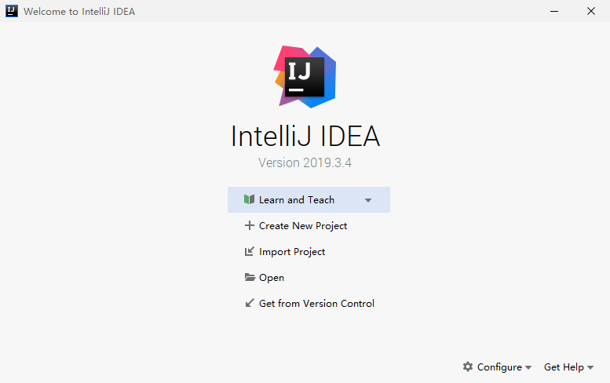


2. 选择`Maven`并直接点击`Next`

   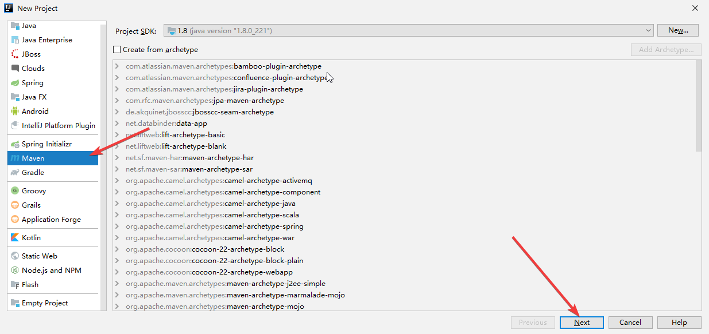


3. 有关这几个选项有必要解释一下

   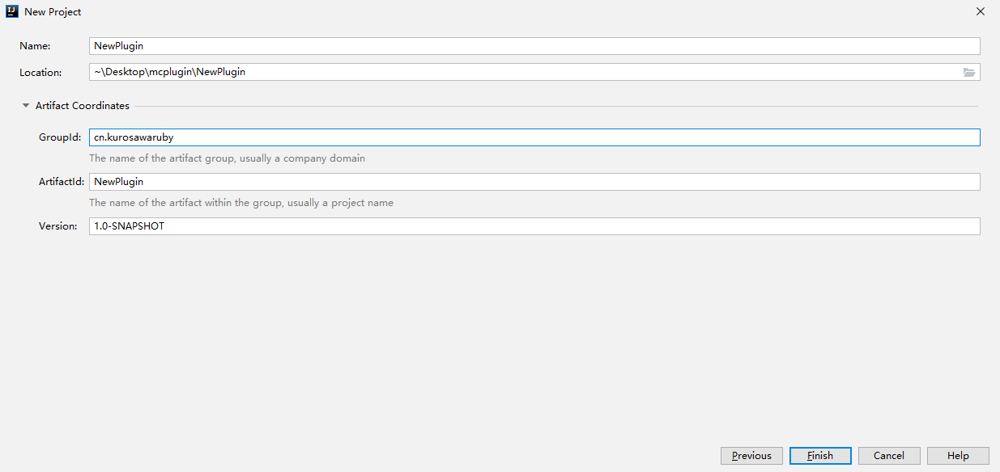

  * `Name` 项目的名字，可以随便取
  * `Location` 项目文件的存储地址，可以自己修改
  * `GroupId` 如果你有域名的话，可以填你的域名，但是需要反过来填写，例如我的域名是`kurosawaruby.cn`，那么我就要写成`cn.kurosawaruby`，当然你随便写也是没问题的(，这个的目的主要是为了防止包名的冲突，不过你自己瞎编不要编一个别人的域名出来..
  * `ArtifactId` 你的插件名字
  * `Version` 插件的版本

4. 填写完毕之后点击`Finish`就行啦~，接下来你就可以在`src/main`目录下添加新的包和类了

   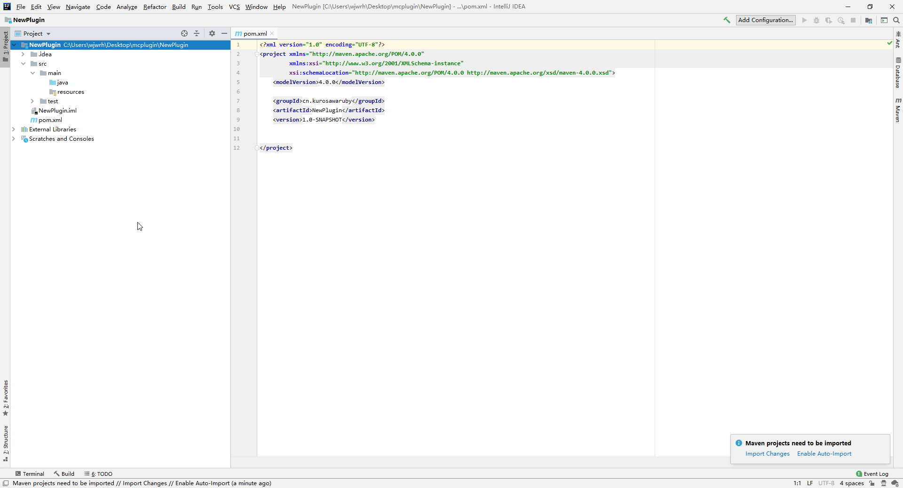

   

## 四、IDEA&Maven代理的配置

* 没有代理的同学可以跳过这一条
* **强烈建议**大陆用户使用代理，否则你可能会被低于`10kb/s`的下载速度折磨的痛不欲生

### 1. IDEA代理配置

* 同时按下`Ctrl + Alt + S`，打开IDEA的Settings界面

  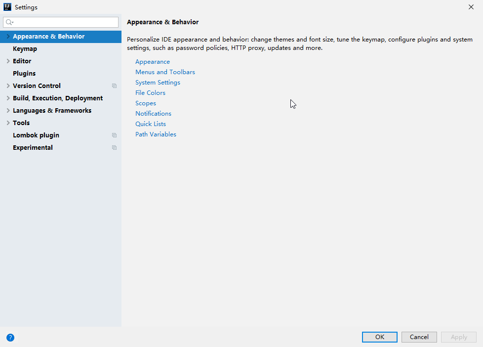

* 在搜索框中输入`Proxy`，便会进入IDEA的代理设置界面

  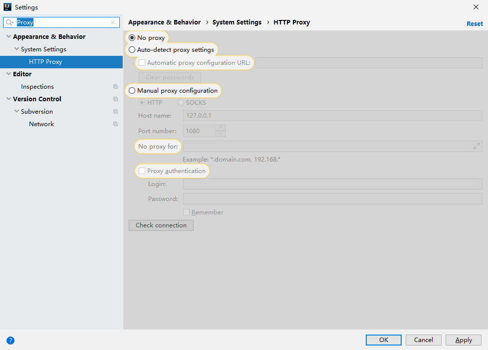

* 勾选`Manual proxy configuration`这里有几个设置项目，设置完成后点击`Apply`保存即可

  * `代理协议`： 这里推荐使用`HTTP`代理，因为IDEA貌似使用的是socks4代理，而现在主流的代理软件使用的协议都是socks5，注意，如果是使用`V2`的用户需要开启HTTP代理模式
  * `Host name`：一般是`localhost(127.0.0.1)`
  * `Post number`：代理端口

  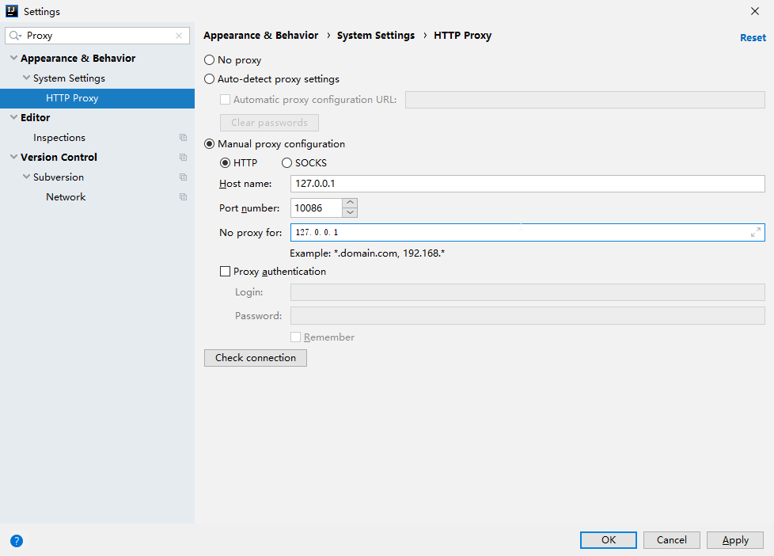

### 2.Maven代理配置

* Maven的代理配置稍显复杂，需要修改Maven的配置文件，首先我们需要找到IDEA的安装目录，使用Toolbox的用户可以在Toolbox的设置中找到

  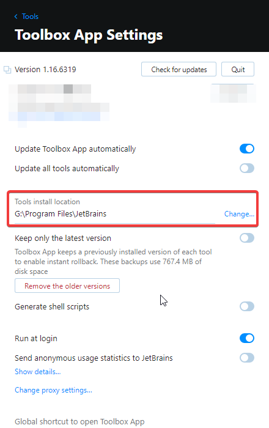

* 打开`{IDEA安装目录}\ch-0\{IDEA内部版本号}\plugins\maven\lib\maven3\conf\settings.xml`，转到proxies标签中，去掉红框表示的注释

  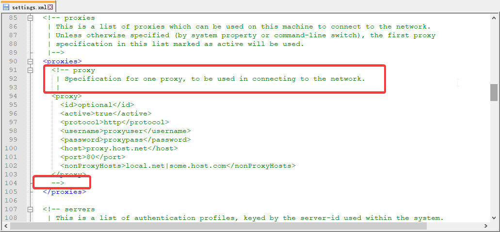

* 修改特定的标签为你所需要的，修改好以后的效果应该是这样

  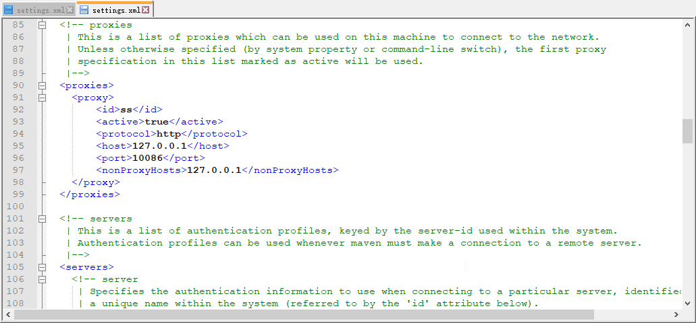

修改完成之后就可以使用代理高速下载了~


## 五、Maven的配置

Maven的配置也是很有讲究的，在一些大型项目中会用到Maven所支持的许多特性，构建一个层次结构分明的依赖管理关系，而本教程作为一个入门教程，并不会教那些很复杂的东西，本教程的目的只有一个——读完教程之后就能够从零开始构建一个自己的插件

### Step 0. 打开pom.xml

在之前创建好的项目中打开`pom.xml`，这个就是本项目的Maven配置文件了，以下所有关于Maven的配置都会在此文件中完成

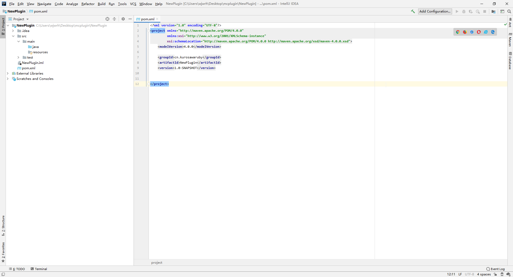


### Step 1. 设置Java源代码的编码方式以及JDK版本

在`pom.xml`的project标签范围内添加以下代码：

```xml
    <properties>
        <project.build.sourceEncoding>UTF-8</project.build.sourceEncoding>
        <maven.compiler.target>1.8</maven.compiler.target>
        <maven.compiler.source>1.8</maven.compiler.source>
    </properties>
```

设置编码方式是为了保证跨平台的兼容性，而设置源及目标的JDK版本是为了能够正确的使用某些特性，否则你在使用lambda的时候都有可能会编译错误

### Step 2. 从远程仓库添加依赖

有时插件作者会以Maven远程仓库的形式提供给你他插件的依赖，你可以在其插件的开发者文档中找到，这里以`Spigot API`举例，我们可以在spigot官方找到

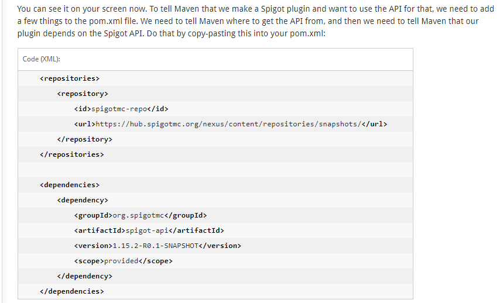

对于尚未添加任何依赖的我们来说，直接把这一段复制进pom.xml就好了，之后Maven会询问我们是否要导入修改，我们可以手动导入，也可以开启自动导入

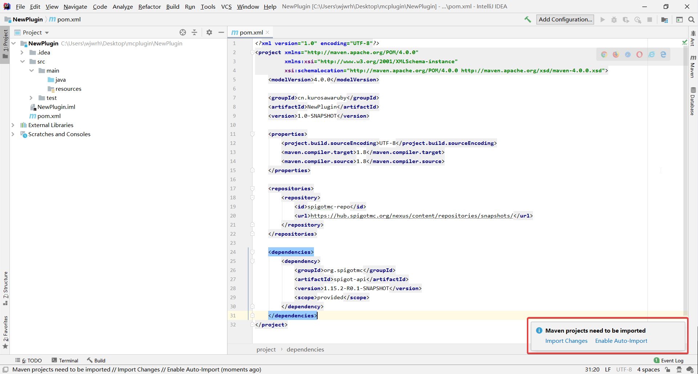

开始导入后，Maven就会自动拉取远程的依赖到本地，如果你没有代理的话你可能需要很久..导入成功后我们就可以在`Maven->Dependencies`中看到我们导入的依赖了

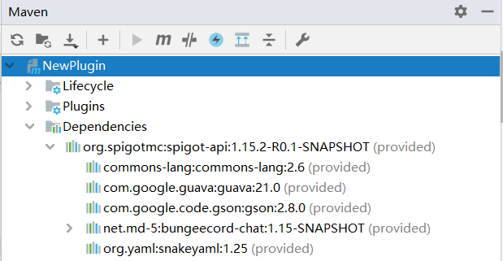

这里值得一提的就是`dependency`中的`scope`标签，这个标签的详解会在下面介绍，姑且让他保持现状，此外就是有多个仓库以及多个远程依赖的情况，我们只需分别在`repositories`中新建`repository`标签，在`dependencies`中新建`dependency`标签即可，效果如下

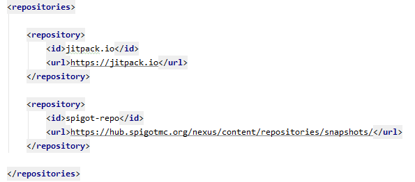


### Step 3. 导入本地jar文件

有时可能插件作者并没有为你提供远程仓库，这个时候我们就需要自行导入本地的jar文件，例如我们要导入桌面上的`Vault.jar`文件，可进行如下操作

1. 在`dependencies`标签中新建`dependency`标签，这里我们需要知道三个值，`groupId, ArtifactId 以及 version`，这三个值我们都可以在插件的`plugin.yml`中找到

   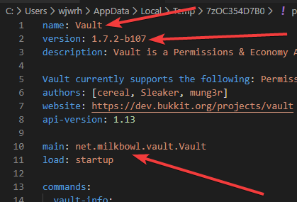

2. 填写上面的值，同时需要设置scope为system，systemPath为你的jar文件的位置

   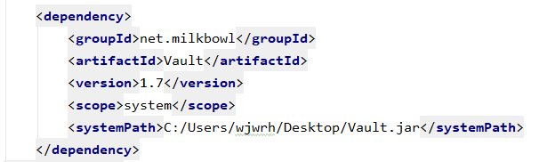

   **强烈不推荐**这种将依赖地址硬编码的方式，这里只是作为演示才这么写的，规范的处理方式应该是在项目根目录中新建一个lib文件夹，将jar文件放入其中，同时将systemPath改为`${basedir}/lib/Vault.jar`


### Step 4. 使用Shade插件

如果你引入了第三方库，那么你就需要使用maven的shade插件将你引入的第三方库一同打包进最终的jar文件中，否则你的插件会因为找不到指定的class而崩溃，Maven Shade插件是一个功能十分强大的插件，关于这个插件的详细配置十分复杂，emmmm以后可能会考虑专门讲解，现在我们只需要把下列代码直接贴进去就能用了

```xml
    <build>
        <plugins>
            <plugin>
                <groupId>org.apache.maven.plugins</groupId>
                <artifactId>maven-shade-plugin</artifactId>
                <version>3.2.0</version>
                <configuration>
                    <minimizeJar>true</minimizeJar>
                    <createDependencyReducedPom>false</createDependencyReducedPom>
                    <createSourcesJar>false</createSourcesJar>
                    <filters>
                        <filter>
                            <artifact>*:*</artifact>
                            <excludes>
                                <exclude>META-INF/*.SF</exclude>
                                <exclude>META-INF/*.DSA</exclude>
                                <exclude>META-INF/*.RSA</exclude>
                            </excludes>
                        </filter>
                    </filters>
                </configuration>
                <executions>
                    <execution>
                        <phase>package</phase>
                        <goals>
                            <goal>shade</goal>
                        </goals>
                    </execution>
                </executions>
            </plugin>
        </plugins>
    </build>
```


### Step 5.关于Scope

常用的scope一共有下列几种

* `compile` 这是默认的scope，表示该依赖参与项目的编译、测试和运行阶段，你使用的第三方(可以理解为跟MC没有直接关系的)依赖请设置为compile(但是我也不知道为什么不用shade不会打包进jar文件..)
* `provided` 它表示这个依赖在运行时由运行时环境提供，不需要打包进jar文件中，通常绝大多数的其它插件API、服务器API使用此模式，因为在运行时服务端中其它运行中的对应插件会提供指定的类
* `system` 模式上与provided相同，唯一的区别就是它不来自远程仓库，而来自本地


## 六、实战演示

### 场景一    从零开始自建插件

本场景的最终目的是编译出一个利用`PlaceholderAPI`来向每一个进入服务器的玩家发出固定问候消息的插件。插件极其简单，而且教授编写插件不是本教程的目标，所以暂不在此过多赘述。

* 创建一个全新的`Maven`项目

  这一步在上面已经有详细的讲解，因此不再重复

* 编辑`pom.xml`，添加`spigot-api`与`PlaceholderAPI`

  关于如何添加`PlaceholderAPI`依赖可以到其开发wiki中寻找https://github.com/PlaceholderAPI/PlaceholderAPI/wiki/Hook-into-PlaceholderAPI，以下是我加好各种信息的`pom.xml`

  ```xml
  <?xml version="1.0" encoding="UTF-8"?>
  <project xmlns="http://maven.apache.org/POM/4.0.0"
           xmlns:xsi="http://www.w3.org/2001/XMLSchema-instance"
           xsi:schemaLocation="http://maven.apache.org/POM/4.0.0 http://maven.apache.org/xsd/maven-4.0.0.xsd">
      <modelVersion>4.0.0</modelVersion>
  
      <groupId>cn.kurosawaruby</groupId>
      <artifactId>PluginTest</artifactId>
      <version>1.0-SNAPSHOT</version>
  
      <properties>
          <project.build.sourceEncoding>UTF-8</project.build.sourceEncoding>
          <maven.compiler.target>1.8</maven.compiler.target>
          <maven.compiler.source>1.8</maven.compiler.source>
          <package>cn.kurosawaruby.PluginTest</package>
      </properties>
  
      <build>
          <resources>
              <resource>
                  <filtering>true</filtering>
                  <directory>src/main/resources</directory>
              </resource>
          </resources>
      </build>
  
      <repositories>
          <repository>
              <id>spigot-repo</id>
              <url>https://hub.spigotmc.org/nexus/content/repositories/snapshots/</url>
          </repository>
  
          <repository>
              <id>placeholderapi</id>
              <url>https://repo.extendedclip.com/content/repositories/placeholderapi/</url>
          </repository>
      </repositories>
  
      <dependencies>
  
          <dependency>
              <groupId>org.spigotmc</groupId>
              <artifactId>spigot-api</artifactId>
              <version>1.15.2-R0.1-SNAPSHOT</version>
              <scope>provided</scope>
          </dependency>
  
          <dependency>
              <groupId>org.jetbrains</groupId>
              <artifactId>annotations</artifactId>
              <version>17.0.0</version>
              <scope>provided</scope>
          </dependency>
  
          <dependency>
              <groupId>org.projectlombok</groupId>
              <artifactId>lombok</artifactId>
              <version>1.18.12</version>
              <scope>provided</scope>
        </dependency>
  
        <dependency>
              <groupId>me.clip</groupId>
              <artifactId>placeholderapi</artifactId>
              <version>2.10.6</version>
              <scope>provided</scope>
          </dependency>
      </dependencies>
  
  </project>
  ```
  
  细心的同学可能已经发现了，上面多了几个新的标签我从来都没有提到过，这里我统一的介绍一下，关于`resources`。你可以在被添加到`resource`的目录下的所有文件中使用`Maven`里定义的变量(实际上不止这些，还可以使用环境变量等等)，使用方式为`${变量名}`，这些变量在打包后会同一被替换为他们相应的值，这个功能最大的好处就是，如果你升级了版本，或者修改了包名或者插件名，你可以不必既在`pom.xml`中修改，又在`plugin.yml`中修改，只需在第一次编写时，在`plugin.yml`中使用变量，那么在修改时统一修改`pom.xml`中的相关值即可，例如我这个插件对应的`plugin.yml`文件如下
  
  ```yaml
  name: ${name}
  main: ${package}.${name}
  version: ${project.version}
  author: wjwrh
  
  depend:
    - PlaceholderAPI
  
  # P.S. 变量package是在pom.xml中properties标签内定义的
  ```
  
* 重新载入`Maven`配置或直接开启自动导入

* 新建主类，如果你套用我上面的一套配置，那么你主类的名称必须为你项目的名称(为了对应`${name}`变量，当然这也是一个不错的习惯)，新建并注册`Listener`，如果上述正常的话此时你应该在调用`PlaceholderAPI`的时候会直接触发自动补全功能

  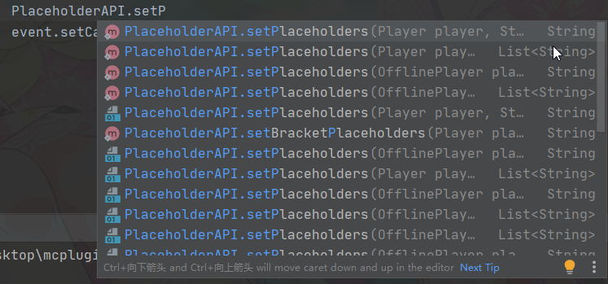

* 完成一切操作之后，点击右侧的`Maven -> 项目名 -> Lifecycle -> package`，一切正常的话，就会在`target`目录下生成你的目标插件


### 场景二    使用他人的源代码编译插件

本场景的最终目的是完成编译两个插件，一个是上古版本停止维护的商店插件`QuickShop`(并非仍在活跃开发的reremake版本)，一个是由多个模块组成的项目`BungeeCord`。前者适用于我们想要魔改某个开源软件的代码来实现自己想要的功能，后者是对模块化`Maven`架构的项目的一个简单的展示(暂时不会介绍技术细节)

#### 1. QuickShop

* 首先从`GitHub`等代码托管网站上获取到你想要的插件的[源代码](https://github.com/KaiKikuchi/QuickShop)，这里推荐一个名为`JetBrains Toolbox Extension`的`Chrome`扩展，它可以直接一键把`Git`仓库的代码克隆到本地并自动创建`IDEA`项目

  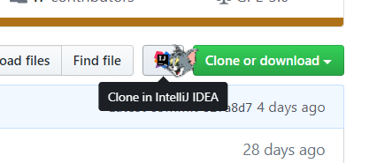

* 如果你没有使用上述扩展的话也没有关系，把代码弄到本地后，点击`IDEA`左上角的`File -> Open`，打开你下载下来的项目文件夹即可，这里有一个非常棘手的问题，那就是作者为了使用`NMS`手动导入了各个版本的服务端文件`Spigot.jar`，但是他在`.gitignore`中把`lib`目录给忽略掉了，导致我们没有办法直接从他那里获取到完整的依赖，我采取的解决方法是将这些服务端一一从网上收集并添加到`lib`文件夹中

  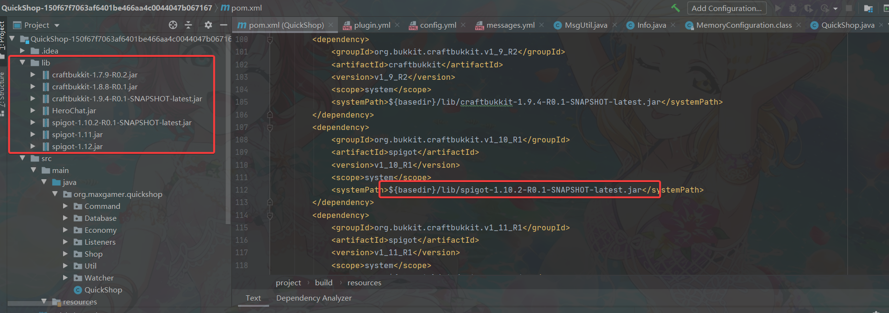

* 修改掉我们想要修改的代码之后，如同上一个场景一样，点击`Maven`然后`Package`即可，需要注意的是你必须关注开源代码所采用的协议，某些协议很有可能会限制你对源代码的某些行为，**请务必留意**


#### 2. BungeeCord

BC是一个由多个模块构成的项目，其[源代码](https://github.com/SpigotMC/BungeeCord)在`GitHub`上进行托管

* 我们首先采取与上述相同的办法将将项目导入`IDEA`

* 我们可以看到右侧的`Maven`框中有若干个项目，而左侧也有若干文件夹，最外层的根目录与每一个文件夹中都包含有一个`pom.xml`，我们可以查看最外层的`pom.xml`内有一个名为`modules`的标签

  ```xml
      <modules>
          <module>api</module>
          <module>bootstrap</module>
          <module>chat</module>
          <module>config</module>
          <module>event</module>
          <module>log</module>
          <module>module</module>
          <module>protocol</module>
          <module>proxy</module>
          <module>query</module>
          <module>native</module>
      </modules>
  ```

  

  他们的关系大概可以理解成为一种树状结构，即最外层的`pom.xml`是一个根节点，而每一个子模块都是它的子节点

* 经过上述的介绍，我们想要编译BC所有模块的话，只需要对"根节点"进行打包即可，有点类似于`makefile`，编译一个文件前会先编译完成它的所有依赖，`Maven`也是一样，编译"根节点"前会逐个编译完它所有的子节点，因此我们只需要在右侧找到带有`root`标示的项目，对它进行`package`即可

  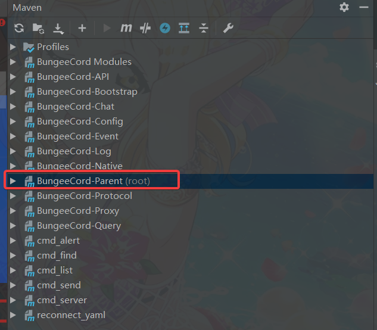

* 编译后我们即可在`target`目录中得到我们需要的

## 七、Q&A

注意：本Q&A主要总结个人在码代码的过程中碰到的有关`Maven`的问题或者我自己认为初次接触`IDEA+Maven`的人会遇到的问题，如果你遇到了别的问题，可以向我提出，我会在尝试解决后将其归纳在本条目中，本条目不定期更新。

### 1. 'mvn' 不是内部或外部命令，也不是可运行的程序或批处理文件

这是典型的环境变量问题，大概设想一下，如果你不提前"告知"系统你的`maven`在哪，你还想让你的系统能够在你输入`mvn`时做出相应，你的系统需要做什么？你的系统需要扫描你的整个硬盘，以找到名为`mvn`的可以运行的程序，但是这还有一个问题，你可能装了`maven2`和`maven3`，甚至装了多个版本相同的`maven`，操作系统要用哪一个？这显然是恨不符合逻辑也不符合现实的。因此，我们需要"告知"操作系统，你的`maven`装在哪。"告知"的方式就是通过环境变量。(其实会接触到插件开发的应该都已经熟知怎么配置环境变量了，不过我还是在这里啰嗦两句吧)

* 右击`此电脑`，单击`属性`

  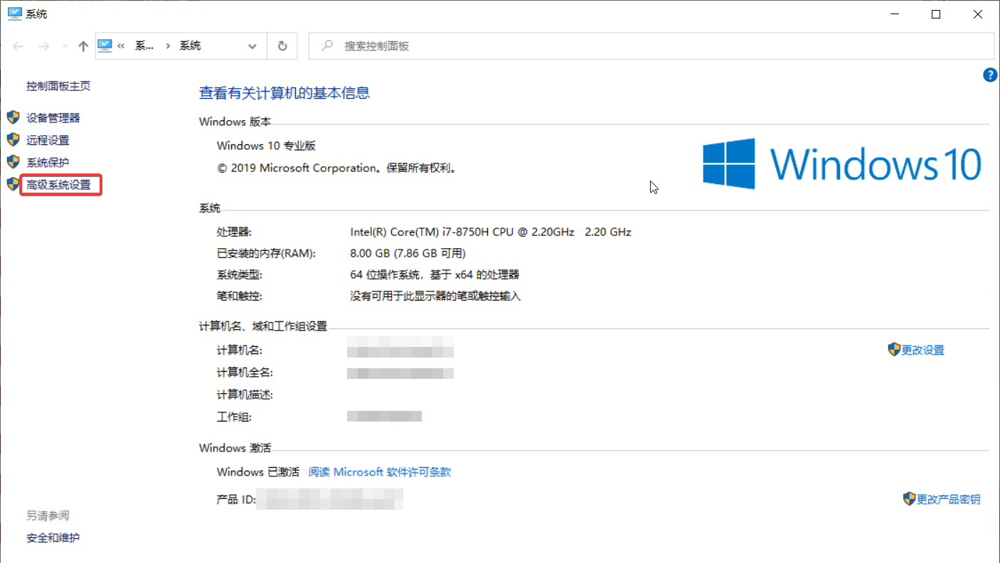

* 点击高级系统设置

* 新建一个名为`MAVEN_HOME`的系统变量，其值为`maven3`的目录，具体怎么寻找参考上面设置代理的相关条目

  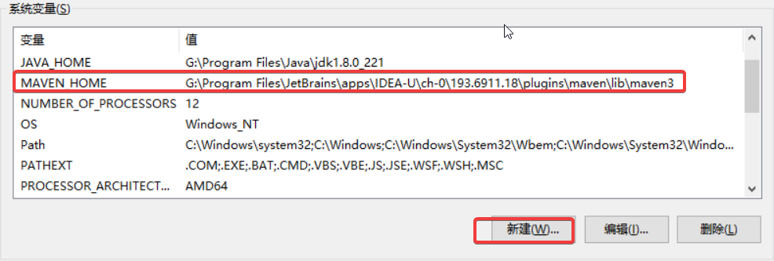

* 再编辑系统变量`Path`，往其中新建一条`%MAVEN_HOME%\bin`(注意，只有较高版本的Windows系统才会有这种把每一条path分开的人性化设置界面，旧版本系统**请在已有的Path后添加`%MAVEN_HOME%\bin`**)

  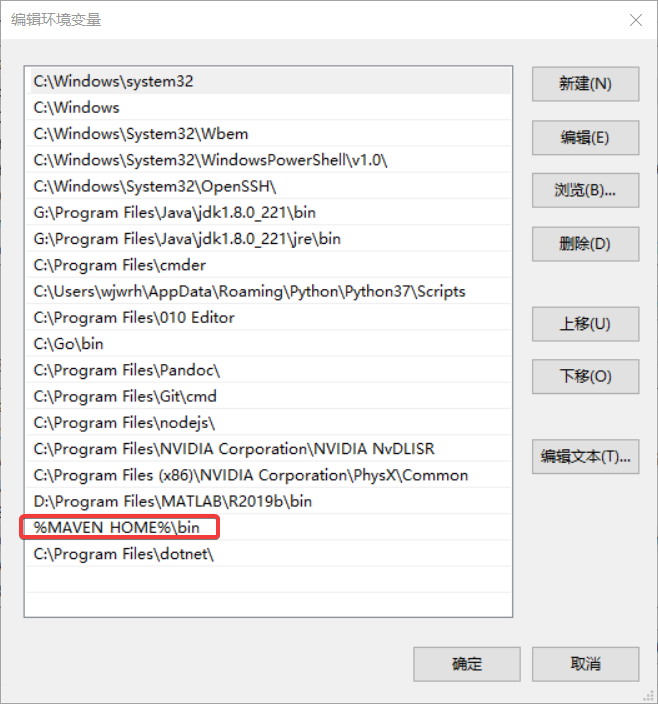

* 确定保存即可，以后再terminal中即可直接输入mvn

### 2. 我的依赖下面有好多红色的波浪线，打包也打包不了怎么办？

这种情况一般是因为依赖文件没有成功拖下来，请尝试点击`Maven`的`Reimport`按钮，并检查依赖所在的依赖仓库是否正确的添加进`pom.xml`中，如果都没有问题

**请务必使用代理**

我之前没有弄代理的时候十有八九会出现这种情况，`Reimport`之后不管等多久，那个条就是跑不完，或者干脆没有进度条，直接就全是红色波浪线，绝大多数都是因为网络质量带来的问题，再说一遍，内地用户请务必使用代理

